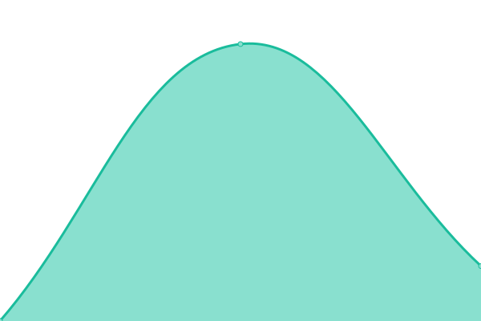

# [📈 Live Status](https://AayushmanChulet.github.io/upptime): <!--live status--> **🟩 All systems operational**

This repository contains the open-source uptime monitor and status page for [AayushmanChulet](https://AayushmanChulet.github.io/upptime), powered by [Upptime](https://github.com/upptime/upptime).

With [Upptime](https://upptime.js.org), you can get your own unlimited and free uptime monitor and status page, powered entirely by a GitHub repository. We use [Issues](https://github.com/AayushmanChulet/upptime/issues) as incident reports, [Actions](https://github.com/AayushmanChulet/upptime/actions) as uptime monitors, and [Pages](https://AayushmanChulet.github.io/upptime) for the status page.

<!--start: status pages-->
<!-- This summary is generated by Upptime (https://github.com/upptime/upptime) -->
<!-- Do not edit this manually, your changes will be overwritten -->
<!-- prettier-ignore -->
| URL | Status | History | Response Time | Uptime |
| --- | ------ | ------- | ------------- | ------ |
|  [AirBnB-Clone](https://airbnb-clone-vvjd.onrender.com) | 🟩 Up | [air-bn-b-clone.yml](https://github.com/AayushmanChulet/upptime/commits/HEAD/history/air-bn-b-clone.yml) | 

 2633ms
     
 | 

<a href="https://AayushmanChulet.github.io/upptime/history/air-bn-b-clone">100.00%</a>
    

|  [IHR Archive (TCP Check)](archive.ihr.live) | 🟩 Up | [ihr-archive-tcp-check.yml](https://github.com/AayushmanChulet/upptime/commits/HEAD/history/ihr-archive-tcp-check.yml) | 

 2ms
     
 | 

<a href="https://AayushmanChulet.github.io/upptime/history/ihr-archive-tcp-check">100.00%</a>
    

|  [IYP Database Connection](iyp-bolt.iijlab.net) | 🟩 Up | [iyp-database-connection.yml](https://github.com/AayushmanChulet/upptime/commits/HEAD/history/iyp-database-connection.yml) | 

 103ms
     
 | 

<a href="https://AayushmanChulet.github.io/upptime/history/iyp-database-connection">100.00%</a>
    

|  [iyp](https://iyp.iijlab.net/) | 🟩 Up | [iyp.yml](https://github.com/AayushmanChulet/upptime/commits/HEAD/history/iyp.yml) | 

 322ms
     
 | 

<a href="https://AayushmanChulet.github.io/upptime/history/iyp">100.00%</a>
    

<!--end: status pages-->

[**Visit our status website →**](https://AayushmanChulet.github.io/upptime)

## 📄 License

- Powered by: [Upptime](https://github.com/upptime/upptime)
- Code: [MIT](./LICENSE) © [Anand Chowdhary](https://anandchowdhary.com), supported by [Pabio](https://pabio.com)
- Data in the `./history` directory: [Open Database License](https://opendatacommons.org/licenses/odbl/1-0/)
