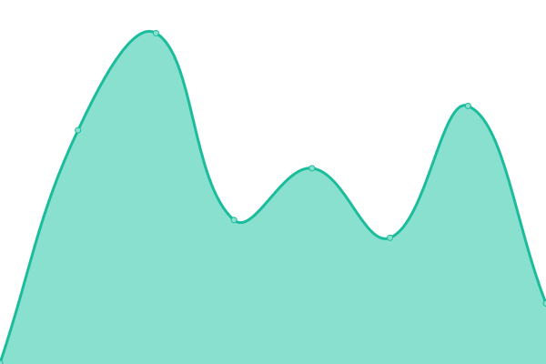

# [📈 Live Status](https://AayushmanChulet.github.io/upptime): <!--live status--> **🟧 Partial outage**

This repository contains the open-source uptime monitor and status page for [AayushmanChulet](https://AayushmanChulet.github.io/upptime), powered by [Upptime](https://github.com/upptime/upptime).

With [Upptime](https://upptime.js.org), you can get your own unlimited and free uptime monitor and status page, powered entirely by a GitHub repository. We use [Issues](https://github.com/AayushmanChulet/upptime/issues) as incident reports, [Actions](https://github.com/AayushmanChulet/upptime/actions) as uptime monitors, and [Pages](https://AayushmanChulet.github.io/upptime) for the status page.

<!--start: status pages-->
<!-- This summary is generated by Upptime (https://github.com/upptime/upptime) -->
<!-- Do not edit this manually, your changes will be overwritten -->
<!-- prettier-ignore -->
| URL | Status | History | Response Time | Uptime |
| --- | ------ | ------- | ------------- | ------ |
|  [ihr](https://www.ihr.live/) | 🟩 Up | [ihr.yml](https://github.com/AayushmanChulet/upptime/commits/HEAD/history/ihr.yml) | 

 512ms
     
 | 

<a href="https://AayushmanChulet.github.io/upptime/history/ihr">100.00%</a>
    

|  [IHR Archive](archive.ihr.live) | 🟩 Up | [ihr-archive.yml](https://github.com/AayushmanChulet/upptime/commits/HEAD/history/ihr-archive.yml) | 

 3ms
     
 | 

<a href="https://AayushmanChulet.github.io/upptime/history/ihr-archive">100.00%</a>
    

|  [IYP Database](iyp-bolt.iijlab.net) | 🟩 Up | [iyp-database.yml](https://github.com/AayushmanChulet/upptime/commits/HEAD/history/iyp-database.yml) | 

 151ms
     
 | 

<a href="https://AayushmanChulet.github.io/upptime/history/iyp-database">100.00%</a>
    

|  [iyp](https://iyp.iijlab.net/) | 🟩 Up | [iyp.yml](https://github.com/AayushmanChulet/upptime/commits/HEAD/history/iyp.yml) | 

 289ms
     
 | 

<a href="https://AayushmanChulet.github.io/upptime/history/iyp">100.00%</a>
    

|  [Neo4j Database](https://de66-49-205-43-52.ngrok-free.app/db/data) | 🟥 Down | [neo4j-database.yml](https://github.com/AayushmanChulet/upptime/commits/HEAD/history/neo4j-database.yml) | 

 573ms
     
 | 

<a href="https://AayushmanChulet.github.io/upptime/history/neo4j-database">4.29%</a>
    

<!--end: status pages-->

[**Visit our status website →**](https://AayushmanChulet.github.io/upptime)

## 📄 License

- Powered by: [Upptime](https://github.com/upptime/upptime)
- Code: [MIT](./LICENSE) © [Anand Chowdhary](https://anandchowdhary.com), supported by [Pabio](https://pabio.com)
- Data in the `./history` directory: [Open Database License](https://opendatacommons.org/licenses/odbl/1-0/)
